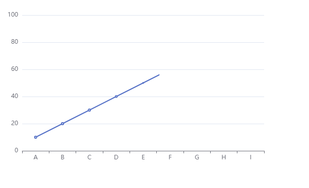
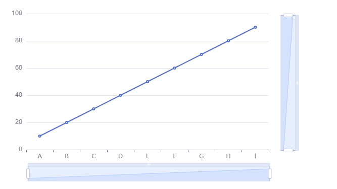
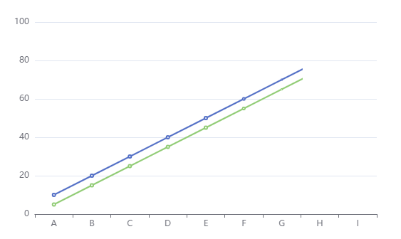
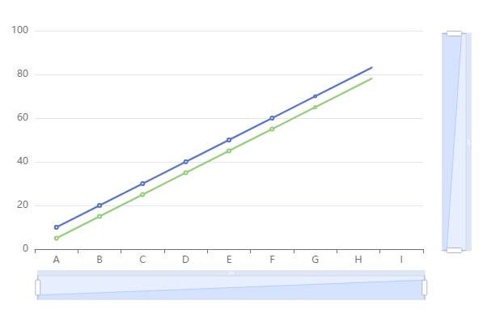
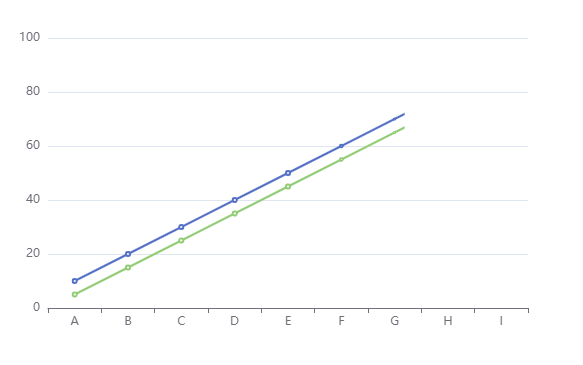

## 单线滚轮联动

```
<!DOCTYPE html>
<html>
<head>
    <meta charset="utf-8">
    <title>ECharts DataZoom</title>
    <script src="https://cdn.jsdelivr.net/npm/echarts@5.2.0/dist/echarts.min.js"></script>
</head>
<body>
    <div id="chart" style="width: 600px; height: 400px;"></div>

    <script>
        // 初始化echarts实例
        var myChart = echarts.init(document.getElementById('chart'));

        // 模拟数据
        var data1 = [10, 20, 30, 40, 50, 60, 70, 80, 90];

        // 配置项
        var option = {
            xAxis: {
                type: 'category',
                data: ['A', 'B', 'C', 'D', 'E', 'F', 'G', 'H', 'I']
            },
            yAxis: {
                type: 'value'
            },
            series: [{
                name: 'Line 1',
                type: 'line',
                data: data1
            }],
            dataZoom: [{
                type: 'inside',
                xAxisIndex: 0,
                start: 0,
                end: 100
            }, {
                type: 'inside',
                yAxisIndex: 0,
                start: 0,
                end: 100
            }]
        };

        // 使用刚指定的配置项和数据显示图表
        myChart.setOption(option);
    </script>
</body>
</html>
```



## 单线鼠标拖动

```
<!DOCTYPE html>
<html>
<head>
    <meta charset="utf-8">
    <title>ECharts DataZoom</title>
    <script src="https://cdn.jsdelivr.net/npm/echarts@5.2.0/dist/echarts.min.js"></script>
</head>
<body>
    <div id="chart" style="width: 600px; height: 400px;"></div>

    <script>
        // 初始化echarts实例
        var myChart = echarts.init(document.getElementById('chart'));

        // 模拟数据
        var data1 = [10, 20, 30, 40, 50, 60, 70, 80, 90];

        // 配置项
        var option = {
            xAxis: {
                type: 'category',
                data: ['A', 'B', 'C', 'D', 'E', 'F', 'G', 'H', 'I']
            },
            yAxis: {
                type: 'value'
            },
            series: [{
                name: 'Line 1',
                type: 'line',
                data: data1
            }],
            dataZoom: [{
                type: 'inside',
                xAxisIndex: 0,
                start: 0,
                end: 100
            }, {
                type: 'inside',
                yAxisIndex: 0,
                start: 0,
                end: 100
            }, {
                type: 'slider',
                xAxisIndex: 0,
                start: 0,
                end: 100
            }, {
                type: 'slider',
                yAxisIndex: 0,
                start: 0,
                end: 100
            }
            ]
        };

        // 使用刚指定的配置项和数据显示图表
        myChart.setOption(option);
    </script>
</body>
</html>
```




## 多线滚轮联动

要通过鼠标滚轮联动变化echarts中的两组线，可以使用echarts的dataZoom组件来实现。dataZoom组件可以通过鼠标滚轮来缩放和平移图表的数据视图。

以下是一个简单的示例代码，展示了如何在echarts中使用dataZoom组件来实现鼠标滚轮联动变化：

```
<!DOCTYPE html>
<html>
<head>
    <meta charset="utf-8">
    <title>ECharts DataZoom</title>
    <script src="https://cdn.jsdelivr.net/npm/echarts@5.2.0/dist/echarts.min.js"></script>
</head>
<body>
    <div id="chart" style="width: 600px; height: 400px;"></div>

    <script>
        // 初始化echarts实例
        var myChart = echarts.init(document.getElementById('chart'));

        // 模拟数据
        var data1 = [10, 20, 30, 40, 50, 60, 70, 80, 90];
        var data2 = [5, 15, 25, 35, 45, 55, 65, 75, 85];

        // 配置项
        var option = {
            xAxis: {
                type: 'category',
                data: ['A', 'B', 'C', 'D', 'E', 'F', 'G', 'H', 'I']
            },
            yAxis: {
                type: 'value'
            },
            series: [{
                name: 'Line 1',
                type: 'line',
                data: data1
            }, {
                name: 'Line 2',
                type: 'line',
                data: data2
            }],
            dataZoom: [{
                type: 'inside',
                xAxisIndex: 0,
                start: 0,
                end: 100
            }, {
                type: 'inside',
                yAxisIndex: 0,
                start: 0,
                end: 100
            }]
        };

        // 使用刚指定的配置项和数据显示图表
        myChart.setOption(option);
    </script>
</body>
</html>

```

在这个示例中，我们使用dataZoom组件来实现鼠标滚轮联动变化。dataZoom组件包含两个部分：水平方向的xAxis和垂直方向的yAxis。我们在配置项dataZoom中定义了两个inside类型的dataZoom，分别与x轴



## 多线鼠标拖动

在echarts中实现鼠标拖动联动变化，可以使用dataZoom组件的slider类型。slider类型的dataZoom可以通过拖动滑块来选择数据范围。

以下是修改后的示例代码，演示了如何在echarts中使用dataZoom组件的slider类型来实现鼠标拖动联动变化：

```
<!DOCTYPE html>
<html>
<head>
    <meta charset="utf-8">
    <title>ECharts DataZoom</title>
    <script src="https://cdn.jsdelivr.net/npm/echarts@5.2.0/dist/echarts.min.js"></script>
</head>
<body>
    <div id="chart" style="width: 600px; height: 400px;"></div>

    <script>
        // 初始化echarts实例
        var myChart = echarts.init(document.getElementById('chart'));

        // 模拟数据
        var data1 = [10, 20, 30, 40, 50, 60, 70, 80, 90];
        var data2 = [5, 15, 25, 35, 45, 55, 65, 75, 85];

        // 配置项
        var option = {
            xAxis: {
                type: 'category',
                data: ['A', 'B', 'C', 'D', 'E', 'F', 'G', 'H', 'I']
            },
            yAxis: {
                type: 'value'
            },
            series: [{
                name: 'Line 1',
                type: 'line',
                data: data1
            }, {
                name: 'Line 2',
                type: 'line',
                data: data2
            }],
            dataZoom: [{
                type: 'slider',
                xAxisIndex: 0,
                start: 0,
                end: 100
            }, {
                type: 'slider',
                yAxisIndex: 0,
                start: 0,
                end: 100
            }]
        };

        // 使用刚指定的配置项和数据显示图表
        myChart.setOption(option);
    </script>
</body>
</html>

```

在这个示例中，我们将dataZoom组件的类型改为slider，并定义了两个slider类型的dataZoom，分别与x轴和y轴关联。通过拖动滑块，可以选择数据的范围，从而实现鼠标拖动联动变化。



## 隐藏拖拽的slider

隐藏拖拽的slider。你可以使用dataZoom组件的show属性来控制slider的显示和隐藏。

以下是一个示例代码，演示了如何隐藏拖拽的slider：

```
<!DOCTYPE html>
<html>
<head>
    <meta charset="utf-8">
    <title>ECharts DataZoom</title>
    <script src="https://cdn.jsdelivr.net/npm/echarts@5.2.0/dist/echarts.min.js"></script>
</head>
<body>
    <div id="chart" style="width: 600px; height: 400px;"></div>

    <script>
        // 初始化echarts实例
        var myChart = echarts.init(document.getElementById('chart'));

        // 模拟数据
        var data1 = [10, 20, 30, 40, 50, 60, 70, 80, 90];
        var data2 = [5, 15, 25, 35, 45, 55, 65, 75, 85];

        // 配置项
        var option = {
            xAxis: {
                type: 'category',
                data: ['A', 'B', 'C', 'D', 'E', 'F', 'G', 'H', 'I']
            },
            yAxis: {
                type: 'value'
            },
            series: [{
                name: 'Line 1',
                type: 'line',
                data: data1
            }, {
                name: 'Line 2',
                type: 'line',
                data: data2
            }],
            dataZoom: [{
                type: 'slider',
                xAxisIndex: 0,
                start: 0,
                end: 100,
                show: false  // 隐藏x轴的slider
            }, {
                type: 'slider',
                yAxisIndex: 0,
                start: 0,
                end: 100,
                show: false  // 隐藏y轴的slider
            }]
        };

        // 使用刚指定的配置项和数据显示图表
        myChart.setOption(option);
    </script>
</body>
</html>

```

在这个示例中，我们将dataZoom组件中的slider的show属性设置为false，从而隐藏了拖拽的slider。你可以根据需要选择隐藏x轴的slider、y轴的slider或者同时隐藏两者。

请根据实际需求修改代码，并根据你的图表要求设置相应的show属性。



## 关闭动画效果

实现鼠标移到图表时不闪动，可以使用echarts的animation配置项来控制图表的动画效果。

以下是一个示例代码，演示了如何在echarts中禁用图表的动画效果：

```
<!DOCTYPE html>
<html>
<head>
    <meta charset="utf-8">
    <title>ECharts Disable Animation</title>
    <script src="https://cdn.jsdelivr.net/npm/echarts@5.2.0/dist/echarts.min.js"></script>
</head>
<body>
    <div id="chart" style="width: 600px; height: 400px;"></div>

    <script>
        // 初始化echarts实例
        var myChart = echarts.init(document.getElementById('chart'));

        // 模拟数据
        var data1 = [10, 20, 30, 40, 50, 60, 70, 80, 90];
        var data2 = [5, 15, 25, 35, 45, 55, 65, 75, 85];

        // 配置项
        var option = {
            xAxis: {
                type: 'category',
                data: ['A', 'B', 'C', 'D', 'E', 'F', 'G', 'H', 'I']
            },
            yAxis: {
                type: 'value'
            },
            series: [{
                name: 'Line 1',
                type: 'line',
                data: data1
            }, {
                name: 'Line 2',
                type: 'line',
                data: data2
            }],
            animation: false  // 禁用动画效果
        };

        // 使用刚指定的配置项和数据显示图表
        myChart.setOption(option);
    </script>
</body>
</html>

```

在这个示例中，我们将配置项animation设置为false，从而禁用了图表的动画效果。这样，当鼠标移到图表上时，就不会出现闪动的效果。

请根据实际需求修改代码，并根据你的图表要求设置相应的animation配置项。


```kotlin
dataZoom:[
          {
            type: "slider", // 在底部
            show: true, // 是否显示 组件。如果设置为 false，不会显示，但是数据过滤的功能还存在。
            start: 0, // 数据窗口范围的起始百分比。范围是：0 ~ 100。表示 0% ~ 100%。
            end: 3, // 数据窗口范围的结束百分比。范围是：0 ~ 100。
            bottom: 25, // 控制滚动条距离底部的位置;
            /**
            不指定时，当 dataZoom-slider.orient 为 'horizontal'时，
            默认控制和 dataZoom 平行的第一个 xAxis。但是不建议使用默认值，建议显式指定。
            如果是 number 表示控制一个轴，如果是 Array 表示控制多个轴。
            */
            xAxisIndex: [0]
          }
        ],
```


```kotlin
 // 两种方式只有dataZoom配置项有区别
  dataZoom:[
          {
            type: "inside", // 内嵌入图标中
            startValue: 0, // 用绝对值的方式定义了窗口数据默认展示的数据开始范围
            endValue: 3, // 用绝对值的方式定义了窗口数据默认展示的数据终止范围
            filterMode: 'filter',
            /**
            不指定时，当 dataZoom-slider.orient 为 'horizontal'时，
            默认控制和 dataZoom 平行的第一个 xAxis。但是不建议使用默认值，建议显式指定。
            如果是 number 表示控制一个轴，如果是 Array 表示控制多个轴。
            */
            xAxisIndex: [0]
          }
        ],
```