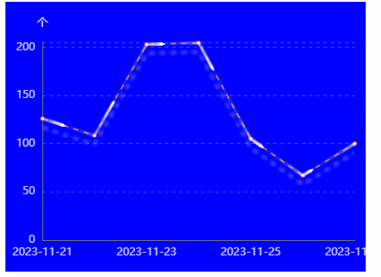

```
<!DOCTYPE html>
<html lang="en">
<head>
    <meta charset="utf-8">
    <meta name="viewport" content="width=device-width,initial-scale=1.0">
    <title>Echarts使用步骤</title>
    <style>
        .box {
            width: 400px;
            height: 300px;
            background-color: blue;
        }
    </style>
</head>
<body>
<script src="https://cdn.staticfile.org/echarts/4.3.0/echarts.min.js"></script>
<div class="box"></div>
<script>
    //单线段（polyline=false），如图右侧各段展示：
    data1 = [
        [
            "日期",
            "实收"
        ],
        [
            "2023-11-21",
            125.948006
        ],
        [
            "2023-11-22",
            108.423342
        ],
        [
            "2023-11-23",
            202.769435
        ],
        [
            "2023-11-24",
            204.346927
        ],
        [
            "2023-11-25",
            105.003044
        ],
        [
            "2023-11-26",
            66.948778
        ],
        [
            "2023-11-27",
            100.055472
        ]
    ]
    let xData1 = data1.slice(1).map(subArray => subArray[0]);
    let yData1 = data1.slice(1).map(subArray => subArray[1]);

    console.log("xData: ", xData1)
    console.log("xData2: ", yData1)

    let yData = yData1,
        xData = xData1,
        datacoords = [];
    for (var i = 0; i < xData.length; i++) {
        datacoords.push([
            {
                coord: [i, yData[i]],
            },
            {
                coord: [i + 1, yData[i + 1]],
            },
        ]);
    }
    console.log(datacoords)
    var myChart = echarts.init(document.querySelector('.box'));
    var option = {
        // animation: true, //控制动画示否开启
        // animationDuration: 8000,
        // animationEasing: "bounceOut", //缓动动画
        // animationThreshold: 3, //动画元素的阈值
        // backgroundColor: "transparent", // 给echarts图设置背景色
        tooltip: {
            trigger: "axis",
            backgroundColor: "rgba(0,0,0,.5)",
            axisPointer: {
                type: "cross",
                label: {
                    backgroundColor: "rgba(0,0,0,.5)",
                },
            },
            textStyle: {
                color: "#fff",
                fontSize: 14,
            },
        },
        grid: {
            left: "3%", //图表距边框的距离
            right: "3%",
            top: "15%",
            bottom: "5%",
            containLabel: true,
        },
        xAxis: [
            {
                nameGap: 3,
                nameTextStyle: {
                    color: "rgba(255,255,255,.8)",
                    fontSize: 12,
                },
                type: "category",
                data: xData,
                boundaryGap: false, //从0开始
                axisLine: {
                    onZero: true,
                    rotate: 30, //坐标轴内容过长旋转
                    interval: 1,
                    lineStyle: {
                        color: "#636E7C",
                    },
                },
                axisLabel: {
                    color: "rgba(255,255,255,.8)", //坐标的字体颜色
                    fontSize: 12,
                },
                axisTick: {
                    //坐标轴刻度颜色  x和y不交叉
                    show: false,
                },
            },
        ],
        yAxis: [
            {
                name: "个",
                min: 0,
                max: function (value) {
                    return Math.ceil(value.max / 5) * 5;
                },
                splitNumber: 5,
                type: "value",
                nameTextStyle: {
                    color: "rgba(255,255,255,.89)",
                    fontSize: 12,
                },
                splitLine: {
                    show: true,
                    lineStyle: {
                        color: "rgba(255,255,255,.25)",
                        type: "dashed",
                    },
                },
                axisTick: {
                    //坐标轴刻度颜色
                    show: false,
                },
                axisLine: {
                    //坐标轴线颜色
                    show: true,
                    lineStyle: {
                        color: "#636E7C",
                    },
                },
                axisLabel: {
                    color: "rgba(255,255,255,.8)", //坐标的字体颜色
                    fontSize: 12,
                },
            },
        ],
        series: [
            {
                type: "line",
                smooth: false,
                lineStyle: {
                    color: "#DC7828",
                    width: 1.5,
                    type: "dashed",
                    shadowOffsetX: 0, // 折线的X偏移
                    shadowOffsetY: 10, // 折线的Y偏移
                    shadowBlur: 4, // 折线模糊
                    shadowColor: "rgba(255, 255, 255, 0.8)", //设置折线阴影颜色
                },
                // showSymbol: true, //是否默认展示圆点
                // symbol: "circle", // 默认是空心圆（中间是白色的）
                // symbolSize: 7,
                // itemStyle: {
                //     color: "#021E47", //实圆的背景色
                //     borderWidth: 1,
                //     borderColor: "#DC7828",
                // },
                // areaStyle: {
                //     color: new echarts.graphic.LinearGradient(0, 1, 0, 0, [
                //         {
                //             offset: 1,
                //             color: "rgba(220,120,40,0.8)",
                //         },
                //         {
                //             offset: 0.74,
                //             color: "rgba(220,120,40,0.5)",
                //         },
                //         {
                //             offset: 0,
                //             color: "rgba(220,120,40,0)",
                //         },
                //     ]),
                // },
                emphasis: {
                    focus: "series",
                },
                data: yData,
            },
            {
                showSymbol: false,
                type: "lines",
                polyline: true,
                smooth: false,
                coordinateSystem: "cartesian2d",
                zlevel: 1,
                effect: {
                    show: true,
                    smooth: true,
                    period: 1,
                    symbolSize: 4,
                    trailLength: 0.5,
                    symbol: 'triangle',
                    loop: true
                },
                lineStyle: {
                    color: "#fff",
                    width: 1,
                    opacity: 0,
                    curveness: 0,
                    cap: "round",
                },
                data: datacoords,
            },
        ],

    };
    myChart.setOption(option);
</script>
</body>
</html>
```




refer:

[折线流光图](https://www.jianshu.com/p/e0eaa84191dc)

