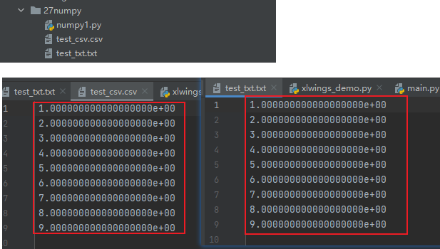

numpy


推荐文章

> https://zhuanlan.zhihu.com/p/504917890?utm_medium=social&utm_oi=803714813804044288

## 安装

```
pip install numpy
```


```
# -- coding:utf-8 --
import numpy

print(numpy.__version__)
```


> 1.23.5


## 数组创建

### 一维数组

```
import numpy as np

# 使用numpy创建数组,得到ndarray的类型
arr = np.array([1, 2, 3])
print(arr)
```


> [1, 2, 3]


查看类型

```
import numpy as np

# 使用numpy创建数组,得到ndarray的类型
arr = np.array([1, 2, 3])
print(arr)
print(arr.dtype)
```


> [1 2 3]
> int32

设置类型

```
import numpy as np

# 使用numpy创建数组,得到ndarray的类型
arr = np.array([1, 2, 3], dtype='float32')
print(arr)
```


> [1. 2. 3.]
>
> float32


#### 线性序列数组

线性序列数组，也称顺序数组；

```
import numpy as np

arr = np.arange(18)
print(arr)
```


> [ 0  1  2  3  4  5  6  7  8  9 10 11 12 13 14 15 16 17]


```
import numpy as np

# 使用numpy创建数组,得到ndarray的类型
# 步长为2
arr = np.arange(0, 20, 2)
print(arr)

```


> [ 0  2  4  6  8 10 12 14 16 18]

#### 全0数组

整形【float】数据

 numpy.zeros(shape, dtype = float, order = 'C') 

数据类型默认float；


整形【int】数据

```
import numpy as np

arr = np.zeros([3, 3], dtype=int)
print(arr)
```


> [[0 0 0]
>  [0 0 0]
>  [0 0 0]]

#### 全1数组

ones(shape, dtype=None, order='C', *, like=None)


```
import numpy as np

arr = np.ones(5)
print(arr)

```


> [1. 1. 1. 1. 1.]


```
import numpy as np

arr = np.ones(5, dtype=int)
print(arr)
```


> [1 1 1 1 1]


如果期望输出数据为整形【int】，只需指定数据类型即可`dtype=int`;

指定值数组


#### 全数组

```
import numpy as np

# 使用numpy创建数组,得到ndarray的类型
arr = np.full(5, 2.66)
print(arr)

```


### 二维数组

不同于 Python 列表，NumPy 数组可以被指定为多维的，内部的列表被党组二维数组的行。

```
import numpy as np
wsw_list = [[1, 2, 3], [3, 4, 5]]
arr = np.array(wsw_list)
print(arr)

```


> [[1 2 3]
>  [3 4 5]]


#### 全0数组
```
import numpy as np

arr = np.zeros([3, 3])
print(arr)
```


> [[0. 0. 0.]
>  [0. 0. 0.]
>  [0. 0. 0.]]

#### 全1数组

```
import numpy as np

arr = np.ones((2, 1))
print(arr)

```


> [[1.]
>  [1.]]


```
import numpy as np

arr = np.ones([3, 3])
print(arr)
```


> [[1. 1. 1.]
>  [1. 1. 1.]
>  [1. 1. 1.]]

#### 全数组

```
import numpy as np

# 使用numpy创建数组,得到ndarray的类型
arr = np.full([3, 3], 2.66)
print(arr)

```


> [[2.66 2.66 2.66]
>  [2.66 2.66 2.66]
>  [2.66 2.66 2.66]]

#### 单位矩阵

生成斜角对称的数组，创建一个正方的n*n单位矩阵，对角线为1，其余为0；

```
import numpy as np

arr = np.eye(5)
print(arr)
```


>[[1. 0. 0. 0. 0.]
> [0. 1. 0. 0. 0.]
> [0. 0. 1. 0. 0.]
> [0. 0. 0. 1. 0.]
> [0. 0. 0. 0. 1.]]


np.ones_like(a)：根据数组a的形状生成一个全1数组；

```
import numpy as np

res = np.ones_like([5, 5, 5, 5, 5])
print(res)
```


> [1 1 1 1 1]

np.zeros_like(a)：根据数组a的形状生成一个全0数组；

```
import numpy as np

res = np.zeros_like([5, 5, 5, 5, 5])
print(res)
```


> [0 0 0 0 0]

np.full_like(a,fill_value)：根据数组a的形状生成一个每个元素值都是val的数组；

```
import numpy as np

res = np.full_like([5, 5, 5, 5, 5], fill_value=5)
print(res)
```


> [5 5 5 5 5]

### 随机数组


#### `random`函数

`random`函数是最常见的生成随机数的方法，用于在区间`[0,1)`中生成均匀分布的随机数或随机数数组。

函数格式为`random(size=None)`，`size`参数可选，即结果数组的形状元组，默认值为`None`，生成一个`[0,1)`之间的随机浮点数。

```
import numpy as np

# 生成一维随机数组
arr = np.random.random(10)
print(arr)
```


> [0.19084259 0.80641696 0.83430115 0.82441213 0.80933874 0.73819315
>  0.09537047 0.9979381  0.51495289 0.63797802]


```
import numpy as np


# 生成二维随机数组，3个数组，每个里面4个元素
arr = np.random.random((3,4))
print("参数为元祖 : ")
print(arr)
```


> 参数为元祖 : 
> [[0.88235834 0.46408767 0.41227015 0.23457363]
>  [0.87032777 0.69235158 0.55440087 0.67796436]
>  [0.29978936 0.46217782 0.20430409 0.66952239]]


```
import numpy as np

arr = np.random.random([3,4])
print("参数为列表 : ")
print(arr)
```


> 参数为列表 : 
> [[0.64726925 0.78319662 0.01648271 0.39743625]
>  [0.97640881 0.49631858 0.33430847 0.60198554]
>  [0.54798112 0.26877063 0.29249927 0.01846644]]


#### `rand`均匀分布

`rand`函数在区间`[0,1)`中生成服从均匀分布的随机数或随机数数组。

函数格式为`rand(d0, d1, ..., dn)`，参数可选，即结果数组的形状，每个维度占据一个参数位置。如果没有参数则生成一个`[0,1)`之间的随机浮点数。

##### 一维数组

```
import numpy as np

arr = np.random.rand()
print(arr)
```


> 0.08288712097029172


生成0到1之间的10个随机数：[0,1)

```
import numpy as np

arr = np.random.rand(10)
print(arr)
```


> [0.41069752 0.30478301 0.98371019 0.61863877 0.25433161 0.65626638
>  0.32200205 0.45942578 0.32080436 0.50434205]

生成0到9之间的10个随机数：[0,10)

```
import numpy as np

arr = np.random.randint(10)
print(arr)

```


> 5

##### 二维数组

```
import numpy as np

arr = np.random.rand(2, 5)
print(arr)
```


> [[0.30754309 0.16191682 0.86757431 0.34558298 0.98175977]
>  [0.90981312 0.5313833  0.77650445 0.35493384 0.50125182]]


```
import numpy as np

arr = np.random.random([2, 5])
print(arr)
print("***"*20)
arr = np.random.random((2, 5))
print(arr)
```


> [[0.42295732 0.29399267 0.23792727 0.54007872 0.87273931]
>  [0.0657386  0.81538549 0.92514877 0.23200334 0.96003653]]
>
> ************************************
>
> [[0.02125068 0.00868899 0.43217625 0.23974446 0.83003554]
>  [0.81465344 0.43338068 0.72700571 0.38505059 0.28456454]]


#### `random_sample`: 均匀分布

均匀分布 0.0到1.0的随机数；

函数格式：`random_sample(size=None)`

返回一个随机浮点型数据，[0.0, 1.0)

numpy.random.random_sample()和np.random.rand()相同，返回一组0.0到1.0之间的随机数。不同的是指定参数的类型。
numpy.random.random_sample()的参数类型为tuple（元组）。

```
import numpy as np

# 生成0.0到1.0之间的随机数
arr = np.random.random_sample()
print("生成0.0到1.0之间的随机数 : ")
print(arr)
```


> 生成0.0到1.0之间的随机数 : 
>
> 0.4860555361989135


```
import numpy as np

# 生成长度为4的随机数数组
arr = np.random.random_sample(4)
print("生成长度为4的随机数数组 : ")
print(arr)
```


> 生成长度为4的随机数数组 : 
> [0.59278419 0.69091135 0.0339032  0.50289171]


```
import numpy as np

# 生成4 * 4的随机数数组
arr = np.random.random_sample(4)
print("生成4 * 4的随机数数组 : ")
print(arr)
```


>生成4 * 4的随机数数组 : 
>[0.99117669 0.19326906 0.74074234 0.92739886]


```
import numpy as np

# 生成4 * 3 * 2的随机数数组
arr = np.random.random_sample((4,3,2))
print("生成4 * 3 * 2的随机数数组 : ")
print(arr)
```


> 生成4 * 3 * 2的随机数数组 : 
> [[[0.05035015 0.54042825]
>   [0.45309857 0.23174652]
>   [0.40810729 0.47060538]]
>
>  [[0.94832893 0.02449774]
>   [0.52486285 0.06236364]
>   [0.0921696  0.91233047]]
>
>  [[0.89004258 0.35398415]
>   [0.10390435 0.07220543]
>   [0.67017702 0.60697986]]
>
>  [[0.66769456 0.17661882]
>   [0.78751507 0.05843826]
>   [0.92545084 0.33001051]]]


```
import numpy as np

# 生成4 * 3 * 2的随机数数组
arr = np.random.random_sample([4,3,2])
print("生成4 * 3 * 2的随机数数组 : ")
print(arr)
```


> 生成4 * 3 * 2的随机数数组 : 
> [[[0.53123795 0.00785531]
>   [0.32261846 0.97522997]
>   [0.41437812 0.12128782]]
>
>  [[0.64909679 0.51600842]
>   [0.74357608 0.39161257]
>   [0.20054186 0.50184335]]
>
>  [[0.8303908  0.91129299]
>   [0.3949193  0.51714556]
>   [0.49736085 0.641577  ]]
>
>  [[0.3704593  0.96875195]
>   [0.40128882 0.38098043]
>   [0.02277969 0.4069795 ]]]


#### `randint`均匀分布

randint函数可以生成给定上下限范围的随机数。

函数格式为`randint(low, high=None, size=None, dtype=int)`。

参数顺序： 最小值，最大值，尺寸，类型

其中，参数`low`为最小值，`high`为最大值，`size`为数组维度，`dtype`为数据类型，默认的数据类型是`np.in`t。倘若`high`没有填写，默认生成随机数的范围就是`[0,low)`。`size`是可选项，如果不设置，则仅生成一个随机整数，如果想生成多个随机整数，则需要用一个元组来指定随机整数数组的维度信息。

返回的随机整数范围为`[low,high)`，包含`low`，不包含`high`。

```
import numpy as np

# 生成一个随机整数，指定low
arr = np.random.randint(5)
print("生成一个随机整数，指定low： ")
print(arr)
# 生成随机数组，指定low与size 
# 生成[0,5)之间的 3 x 5 整数数组
arr = np.random.randint(5, size=[3, 5])
print("生成随机数组，指定low与size:")
print(arr)
```


> 生成一个随机整数，指定low： 
> 1
> 生成随机数组，指定low与size:
> [[0 3 3 3 2]
>  [2 3 1 1 1]
>  [3 3 1 1 3]]


```
import numpy as np

# 生成一个随机整数，指定low，high
arr = np.random.randint(5)
print("生成一个随机整数，指定low，high:")
print(arr)
# 生成一个随机整数，指定low，high与size
arr = np.random.randint(5, 20, size=[3, 4])
print("生成一个随机整数，指定low，high与size:")
print(arr)

```


> 生成一个随机整数，指定low，high:
> 2
> 生成一个随机整数，指定low，high与size:
> [[18  7 17 13]
>  [19  8  5  9]
>  [15 13  9  9]]


生成具有 4 个不同上限的 1 x 4 数组

```
import numpy as np

# 生成具有 4 个不同上限的 1 x 4 数组
arr = np.random.randint(1, [6, 8, 10, 12])
print("生成具有 4 个不同上限的 1 x 4 数组 : ")
print(arr)

```


> 生成具有 4 个不同上限的 1 x 4 数组 : 
> [2 2 7 7]


array([2, 2, 9]) # random

生成具有 4 个不同下限的 1 x 4 数组

```
import numpy as np

# 生成具有 4 个不同上限的 1 x 4 数组
arr = np.random.randint(1, [6, 8, 10, 12])
print("生成具有 4 个不同上限的 1 x 4 数组 : ")
print(arr)
```


>
> 生成具有 4 个不同下限的 1 x 4 数组 : 
> [ 5  6 12 14]

####  `randn`正态分布

`randn`函数可以生成服从正态分布的随机数或随机数数组。标准正态分布俗称高斯分布，正态分布是大自然中最常见的分布，标准正态分布就是期望为0，方差为1的正态分布。

函数格式为`rand(d0, d1, ..., dn)`。

如果没有参数，则返回一个值，如果有参数，则返回(d0, d1, …, dn)个值，这些值都是从标准正态分布中随机取样得到的。

参数：

- d0, d1, …, dn：应该为正整数，表示维度。

返回值

- Z：ndarray或者float。


```
import numpy as np

# 生成一个随机数
arr = np.random.randn()
print("生成一个随机数 : ")
print(arr)
```


> 生成一个随机数 : 
> -1.0559933443966047


```
import numpy as np

# 生成一维随机数组，10个元素
arr = np.random.randn(10)
print("生成一维随机数组，10个元素: ")
print(arr)
```


> 生成一维随机数组，10个元素: 
> [ 1.03794597 -0.87345715 -0.32670386  0.40692865  2.10707071 -0.10897079
>   1.35546089 -1.45490691  0.58076704  1.20838585]


```
import numpy as np

# 生成二维随机数组,3行4列
arr = np.random.randn(3,4)
print("生成二维随机数组,3行4列 : ")
print(arr)
```


>生成二维随机数组,3行4列 : 
>[[ 3.61673403  1.19695301 -1.03275352 -2.37712713]
> [-0.55351196 -0.98044649  0.1505964   0.44170254]
> [-0.51563062  0.27335964  1.53017726 -1.46691661]]


#### `normal` 正态分布

numpy.random.normal()返回一组平均为loc，标准差为scale，服从正态分布的随机数。

> numpy.random.normal(loc=0.0, scale=1.0, size=None)

参数size的类型为tuple（元组）

```
import numpy as np

# 生成平均为-3，标准差为1的随机数组
arr = np.random.normal(-3, 1, (3, 3))
print("生成平均为-3，标准差为1的随机数组 : ")
print(arr)
```


> 生成平均为-3，标准差为1的随机数组 : 
> [[-1.09012321 -3.06888808 -3.43196103]
>  [-4.60847618 -2.32198419 -3.19528566]
>  [-2.77107042 -3.30370554 -1.31811821]]


#### `binomial` 二项分布

------

numpy.random.binomial()返回一组服从参数n,p的二项式随机数。

参数size的类型为tuple（元组）

```python
import numpy as np

arr = np.random.binomial(10, 0.5, 10)
print(arr)
```


> [7 4 5 6 7 2 7 5 3 5]


#### 设置精度

around(arr, decimals=0, out=None)

解释：

arr：待处理数组；

decimal：可选参数，精确度， 默认值为0， 如果为负，整数将四舍五入到小数点左侧的位置；

out：可选参数，输出位置

##### 数字操作

```
res = np.around(7)
print(res)
res = np.around(7.11212)
print(res)
res = np.around(7.5)
print(res)
res = np.around(7.49)
print(res)
res = np.around(7.77)
print(res)
```


> 7
> 7.0
> 8.0
> 7.0
> 8.0


```
import numpy as np

res = np.around(7)
print("四舍五入结果： ", res)
res = np.around(7.12345, 0)
print("四舍五入结果： ", res)
res = np.around(7.12345, 1)
print("四舍五入到十分位： ", res)
res = np.around(7.12345, 2)
print("四舍五入到百分位： ", res)
res = np.around(7.12345, 3)
print("四舍五入到千分位： ", res)
res = np.around(7.12345, 4)
print("四舍五入到万分位： ", res)
res = np.around(7.12345, decimals=4)
print("四舍五入到万分位： ", res)
res = np.around(7.12345, decimals=10)
print("四舍五入到小数点后10位： ", res)
# res = np.around(7.5)
```


> 四舍五入结果：  7
> 四舍五入结果：  7.0
> 四舍五入到十分位：  7.1
> 四舍五入到百分位：  7.12
> 四舍五入到千分位：  7.123
> 四舍五入到万分位：  7.1234
> 四舍五入到万分位：  7.1234
> 四舍五入到小数点后10位：  7.12345

在上面的例子中有几点需要注意：

- 省略小数参数或使用值0返回相同的结果。

- decimals是np.around（）中的第二个参数，因此可以使用它，也可以不使用decimals关键字。

- 如果输入的小数值超过了输入数字的小数位数，则返回相同的输入数字。

```
import numpy as np

res = np.around(1234.56)
print("四舍五入到个位： ", res)
res = np.around(1234.56, -1)
print("四舍五入到十位： ", res)
res = np.around(1234.56, -2)
print("四舍五入到百位： ", res)
res = np.around(1234.56, -3)
print("四舍五入到千位： ", res)
res = np.around(1234.56, -4)
print("四舍五入到万位： ", res)
```


> 四舍五入到个位：  1235.0
> 四舍五入到十位：  1230.0
> 四舍五入到百位：  1200.0
> 四舍五入到千位：  1000.0
> 四舍五入到万位：  0.0

##### 数组操作

```
arr = np.array([1.234, 66.5432, 889.9])
res = np.around(arr)
print("四舍五入到个位： ", res)
res = np.around(arr, 1)
print("四舍五入到十分位： ", res)
res = np.around(arr, 2)
print("四舍五入到百分位： ", res)
res = np.around(arr, 3)
print("四舍五入到千分位： ", res)
res = np.around(arr, -1)
print("四舍五入到十位： ", res)
```


> 四舍五入到个位：  [  1.  67. 890.]
> 四舍五入到十分位：  [  1.2  66.5 889.9]
> 四舍五入到百分位：  [  1.23  66.54 889.9 ]
> 四舍五入到千分位：  [  1.234  66.543 889.9  ]
> 四舍五入到十位：  [  0.  70. 890.]


#### 拓展

在此，对以下的内容进行说明：

- 生成均匀分布的随机数。
  - numpy.random.rand(): 0.0到1.0
  - numpy.random.random_sample(): 0.0到1.0
  - numpy.random.randint()：任意值范围的整数
- 生成正态分布的随机数。
  - numpy.random.randn(): 平均为0，标准差为1
  - numpy.random.normal(): 任意值的平均和标准差
- 生成二项式的随机数。
  - numpy.random.binomial()
- 生成Beta分布的随机数。
  - numpy.random.beta()
- 生成Gamma分布的随机数。
  - numpy.random.gamma()
- 生成卡方分布的随机数。
  - numpy.random.chisquare()

参考：https://blog.csdn.net/qq_18351157/article/details/104061348

## 数剧类型

NumPy标准数据类型

| 数据类型   | 描述                                                         |
| ---------- | ------------------------------------------------------------ |
| bool_      | 布尔值（真、True  或假、False ），用一个字节存储             |
| int_       | 默认整型（类似于 C 语言中的 long ，通常情况下是 int64  或 int32 ） |
| intc       | 同 C 语言的 int  相同（通常是 int32  或 int64 ）             |
| intp       | 用作索引的整型（和 C 语言的 ssize_t  相同，通常情况下是 int32  或 int64 ） |
| int8       | 字节（byte，范围从–128 到 127）                              |
| int16      | 整型（范围从–32768 到 32767）                                |
| int32      | 整型（范围从–2147483648 到 2147483647）                      |
| int64      | 整型（范围从–9223372036854775808 到 9223372036854775807）    |
| uint8      | 无符号整型（范围从 0 到 255）                                |
| uint16     | 无符号整型（范围从 0 到 65535）                              |
| uint32     | 无符号整型（范围从 0 到 4294967295）                         |
| uint64     | 无符号整型（范围从 0 到 18446744073709551615）               |
| float_     | float64  的简化形式                                          |
| float16    | 半精度浮点型：符号比特位，5 比特位指数（exponent），10 比特位尾数（mantissa） |
| float32    | 单精度浮点型：符号比特位，8 比特位指数，23 比特位尾数        |
| float64    | 双精度浮点型：符号比特位，11 比特位指数，52 比特位尾数       |
| complex_   | complex128  的简化形式                                       |
| complex64  | 复数，由两个 32 位浮点数表示                                 |
| complex128 | 复数，由两个 64 位浮点数表示                                 |

还可以进行更高级的数据类型指定，例如指定高位字节数或低位字节数；更多的信息可以在 NumPy 文档（http://numpy.org/）中查看。

#### 查看数据类型

```
import numpy as np

arr1 = np.array([1, 2, 3, 4, 5, 6])
print(arr1.dtype)
print(arr1.dtype.name)
```


> int32
> int32


#### 转换数据类型

int32 ---> float64

```
import numpy as np

arr1 = np.array([1, 2, 3, 4, 5, 6])
# 数据类型转换为float64
float_arr1 = arr1.astype(np.float64)
print("arr1 data type: ", arr1.dtype)
print("float arr1 data type: ", float_arr1.dtype.name)
```


> arr1 data type:  int32
> float arr1 data type:  float64

float64 --->int64

```
import numpy as np


arr1 = np.array([1.1, 2.2, 3.3, 4.4, 5.5, 6.6])
# 数据类型转换为float64
float_arr1 = arr1.astype(np.int64)
print("arr1 data type: ", arr1.dtype)
print("float arr1 data type: ", float_arr1.dtype.name)
print("float arr1 data : ", float_arr1)
```


> arr1 data type:  float64
> float arr1 data type:  int64
> float arr1 data :  [1 2 3 4 5 6]


## 数组属性


#### shape

表示数组的维度，返回一个元组，这个元组的长度就是维度的数目，即 ndim 属性(秩)。比如，一个二维数组，其维度表示"行数"和"列数"。

##### 获取维度

```
import numpy as np

# 一维数组的shape
arr = np.array([1, 2, 3, 4, 5, 6])
print("一维数组的shape: ", arr.shape)
# 二维数组的shape
arr = np.array([[1, 2, 3], [4, 5, 6]])
print("二维数组的shape:", arr.shape)
```


> 一维数组的shape:  (6,)
> 二维数组的shape: (2, 3)

##### 调整维度


```
import numpy as np

# 一维数组的shape
arr = np.array([1, 2, 3, 4, 5, 6])
print("一维数组的shape: ", arr.shape)
print("调整前： \n", arr)

arr = arr.reshape(3,2)
print("调整后： \n", arr)

# 二维数组的shape
arr = np.array([[1, 2, 3], [4, 5, 6]])
print("二维数组的shape:", arr.shape)
print("调整前： \n", arr)
arr = arr.reshape(3,2)
print("调整后： \n", arr)
```


> 一维数组的shape:  (6,)
> 调整前： 
>  [1 2 3 4 5 6]
> 调整后： 
>  [[1 2]
>  [3 4]
>  [5 6]]
> 二维数组的shape: (2, 3)
> 调整前： 
>  [[1 2 3]
>  [4 5 6]]
> 调整后： 
>  [[1 2]
>  [3 4]
>  [5 6]]


#### size

```
import numpy as np


# 一维数组的size
arr = np.array([1, 2, 3, 4, 5, 6])

print("一维数组的size : ", arr.size)

# 二维数组的size
arr = np.array([[1, 2, 3], [4, 5, 6]])
print("二维数组的size : ", arr.size)
```


> 一维数组的size :  6
> 二维数组的size :  6


#### dtype

```
import numpy as np


# 一维数组的dtype
arr = np.array([1, 2, 3, 4, 5, 6])

print("一维数组的dtype : ", arr.dtype)

# 二维数组的dtype
arr = np.array([[1, 2, 3], [4, 5, 6.1]])
print("二维数组的dtype : ", arr.dtype)

```


>一维数组的dtype :  int32
>二维数组的dtype :  float64
>
>

## 数组四则运算


```
arr1 = np.array([1, 2, 3, 4, 5, 6])
add = arr1 + 1
sub = arr1 - 1
mul = arr1 * 3
div = arr1 / 2
print(f"add : {add}")
print(f"sub : {sub}")
print(f"mul : {mul}")
print(f"div : {div}")
```


> add : [2 3 4 5 6 7]
> sub : [0 1 2 3 4 5]
> mul : [ 3  6  9 12 15 18]
> div : [0.5 1.  1.5 2.  2.5 3. ]


## 数组增删改查

### 增

### 删

### 改

### 查


## 数组取整

### 向下取整

np.floor()

np.floor 返回不大于输入参数的最大整数。 即对于输入值 x ，将返回最大的整数 i ，使得 i <= x。 注意在Python中，向下取整总是从 0 舍入。


### 向上取整

np.ceil()

np.ceil 函数返回输入值的上限，即对于输入 x ，返回最小的整数 i ，使得 i> = x。

### 代码示例：

##### 普通数字

```
import numpy as np

# 数字
arr = np.array(-2.4)
ceil = np.ceil(arr)
print(f"====ceil :\n {ceil}")
floor = np.floor(arr)
print(f"=====floor :\n{floor}")
```

> ====ceil :
>  -2.0
> =====floor :
> -3.0

#####  一维数组

```
import numpy as np

# 数字
arr = np.array(-2.4)
ceil = np.ceil(arr)
print(f"====ceil :\n {ceil}")
floor = np.floor(arr)
print(f"=====floor :\n{floor}")

# 一维数组
arr = np.array([-2.4, -3.2, -0.2, 1.8, 5.1, 3.4, 21.7, 21.7])
ceil = np.ceil(arr)
print(f"====ceil :\n {ceil}")
floor = np.floor(arr)
print(f"=====floor :\n {floor}")
```


> ====ceil :
>  [-2. -3. -0.  2.  6.  4. 22. 22.]
> =====floor :
>  [-3. -4. -1.  1.  5.  3. 21. 21.]


##### 二维数组

```
import numpy as np

# 二维数组
arr = np.array([[-2.4, -3.2], [-0.2, 1.8], [5.1, 3.4], [21.7, 21.7]])
ceil = np.ceil(arr)
print(f"====ceil :\n {ceil}")
floor = np.floor(arr)
print(f"=====floor :\n {floor}")
```


> ====ceil :
>  [[-2. -3.]
>  [-0.  2.]
>  [ 6.  4.]
>  [22. 22.]]
> =====floor :
>  [[-3. -4.]
>  [-1.  1.]
>  [ 5.  3.]
>  [21. 21.]


## 数组排序

### sort

语法：

numpy.sort(a[, axis=-1, kind=‘quicksort’, order=None])

解释：

**axis**：排序沿数组的（轴）方向，0表示按行，1表示按列，None表示展开来排序，默认为-1，表示沿最后的轴排序。
**kind**：排序的算法，提供了快排’quicksort’、混排’mergesort’、堆排’heapsort’， 默认为‘quicksort’。
**order**：排序的字段名，可指定字段排序，默认为None。

返回排序后数组，原数组不修改；

```
import numpy as np

arr = np.array([9, 4, 7, 2, 5, 6, 3 , 8, 1])

sort = np.sort(arr)
print(sort)
print(arr)
```


> [1 2 3 4 5 6 7 8 9]

### argsort

argsort是一种间接排序的方法，他返回的是排序好的原数组的index

语法：

numpy.argsort(a[, axis=-1, kind=‘quicksort’, order=None])

解释：


```
import numpy as np

arr = np.array([9, 4, 7, 2, 5, 6, 3 , 8, 1])

sort = np.argsort(arr)
print("原数组 ： \n", sort)
print("新数组 ： \n", arr)
```


> 原数组 ：
>
> [8 3 6 1 4 5 2 7 0]
>
> 新数组 ：
>
> [9 4 7 2 5 6 3 8 1]


```
import numpy as np

np.random.seed(8)
x = np.random.randint(0, 10, 10)
print("生成10个随机数字的数组 ： \n", x)

y = np.argsort(x)
print("排序后每个元素对应的索引： \n", y)
print("根据索引获取新的数组：\n", x[y])
```


> 生成10个随机数字的数组 ： 
>  [3 4 1 9 5 8 3 8 0 5]
> 排序后每个元素对应的索引： 
>  [8 2 0 6 1 4 9 5 7 3]
> 根据索引获取新的数组：
>  [0 1 3 3 4 5 5 8 8 9]
>

逆向排序

```
import numpy as np

np.random.seed(8)
x = np.random.randint(0, 10, 10)
print("生成10个随机数字的数组 ： \n", x)

# 逆向排序
y = np.argsort(-x)
print("排序后每个元素对应的索引： \n", y)
print("根据索引获取新的数组：\n", x[y])
```


> 生成10个随机数字的数组 ： 
>  [3 4 1 9 5 8 3 8 0 5]
>
> 排序后每个元素对应的索引： 
>  [3 5 7 4 9 1 0 6 2 8]
> 根据索引获取新的数组：
>  [9 8 8 5 5 4 3 3 1 0]

### lexsort()

**numpy.lexsort(keys[, axis=-1])** Perform an indirect stable sort using a sequence of keys.（使用键序列执行间接稳定排序。）
给定多个可以在电子表格中解释为列的排序键，lexsort返回一个整数索引数组，该数组描述了按多个列排序的顺序。序列中的最后一个键用于主排序顺序，倒数第二个键用于辅助排序顺序，依此类推。keys参数必须是可以转换为相同形状的数组的对象序列。如果为keys参数提供了2D数组，则将其行解释为排序键，并根据最后一行，倒数第二行等进行排序。

```
import numpy as np

np.random.seed(8)
x = np.random.rand(4, 4) * 10
x = np.around(x, 2)
print("原始数组 ： \n", x)

index = np.lexsort([x[:, 0]])
print("变换索引 ： \n",index)
y = x[index]
print("变换后数组 ： \n",y)

index = np.lexsort([-1 * x[:, 0]])
print("变换索引 ： \n",index)
y = x[index]
print("变换后数组 ： \n",y)
```


> 原始数组 ： 
>  [[8.73 9.69 8.69 5.31]
>  [2.33 0.11 4.3  4.02]
>  [5.23 4.78 5.55 5.43]
>  [7.61 7.12 6.2  4.26]]
> 变换索引 ： 
>  [1 2 3 0]
> 变换后数组 ： 
>  [[2.33 0.11 4.3  4.02]
>  [5.23 4.78 5.55 5.43]
>  [7.61 7.12 6.2  4.26]
>  [8.73 9.69 8.69 5.31]]
> 变换索引 ： 
>  [0 3 2 1]
> 变换后数组 ： 
>  [[8.73 9.69 8.69 5.31]
>  [7.61 7.12 6.2  4.26]
>  [5.23 4.78 5.55 5.43]
>  [2.33 0.11 4.3  4.02]]

### partition()

**numpy.partition(a, kth, axis=-1, kind=‘introselect’, order=None)** Return a partitioned copy of an array.
以索引是 kth 的元素为基准，将元素分成两部分，即大于该元素的放在其后面，小于该元素的放在其前面，这里有点类似于快排。

`np.partition`是对一个向量、沿着一个维度方向、按照大小对数据进行分堆，分成了两堆。

1. 在`kth`前面的这堆数值，都是这个向量里面比较小的群体们。
2. 在`kth`后面的这堆数值，都是这个向量里面比较大的群体们。

```
import numpy as np

np.random.seed(8)
x = np.random.randint(10, 50, [6, 6])
print("原始数组 ： \n", x)

y = np.sort(x, axis=0)
print("按列排序 ： \n", y)

y = np.sort(x, axis=1)
print("按行排序 ： \n", y)

z = np.partition(x, kth=2, axis=0)
print("按列排序 ： \n", z)

z = np.partition(x, kth=2, axis=1)
print("按行排序 ： \n", z)
```


> 原始数组 ： 
>  [[13 30 15 36 18 29]
>  [31 20 37 23 19 25]
>  [39 44 28 24 48 39]
>  [19 14 17 36 12 48]
>  [19 47 27 25 38 37]
>  [32 41 30 31 18 38]]
> 按列排序 ： 
>  [[13 14 15 23 12 25]
>  [19 20 17 24 18 29]
>  [19 30 27 25 18 37]
>  [31 41 28 31 19 38]
>  [32 44 30 36 38 39]
>  [39 47 37 36 48 48]]
> 按行排序 ： 
>  [[13 15 18 29 30 36]
>  [19 20 23 25 31 37]
>  [24 28 39 39 44 48]
>  [12 14 17 19 36 48]
>  [19 25 27 37 38 47]
>  [18 30 31 32 38 41]]


```\
import numpy as np

np.random.seed(8)
x = np.random.randint(10, 50, [6, 6])
print("原始数组 ： \n", x)

z = np.partition(x, kth=2, axis=0)
print("按列排序 ： \n", z)

z = np.partition(x, kth=2, axis=1)
print("按行排序 ： \n", z)
```


> 原始数组 ： 
>  [[13 30 15 36 18 29]
>  [31 20 37 23 19 25]
>  [39 44 28 24 48 39]
>  [19 14 17 36 12 48]
>  [19 47 27 25 38 37]
>  [32 41 30 31 18 38]]
>
> 按列排序 ： 
>  [[13 14 15 23 12 25]
>  [19 20 17 24 18 29]
>  [19 30 27 25 18 37]
>  [31 44 37 36 19 48]
>  [39 47 28 36 38 39]
>  [32 41 30 31 48 38]]
> 按行排序 ： 
>  [[13 15 18 36 30 29]
>  [19 20 23 37 31 25]
>  [24 28 39 44 48 39]
>  [12 14 17 36 19 48]
>  [19 25 27 47 38 37]
>  [18 30 31 41 32 38]]

这里我们是按列（axis=0）进行的排序

为了验证我们的想法先对原始二维数组进行排序得到z

然后以每一列索引为2即第3个元素进行基准将每一列划分为两部分

比如第一列排序后的第三个元素是19，那么大于它的都放在了其后面，小于其的都放在了其前面

同理第二列排序后的第三个元素是30

第三列排序后的第三个元素是27等等

还有一个问题需要注意的就是放在其后或其前的数组是无序的如第一列的31,39,32；

##### 找出最值

找每一列第二小的数，我们就可以这么做：

```
import numpy as np

np.random.seed(8)
x = np.random.randint(10, 50, [6, 6])
print("原始数组 ： \n", x)

y = np.sort(x, axis=0)
print("按列排序 ： \n", y)

z = np.partition(x, kth=2, axis=0)[1]
print("按列排序 ： \n", z)
```


> 原始数组 ： 
>  [[13 30 15 36 18 29]
>  [31 20 37 23 19 25]
>  [39 44 28 24 48 39]
>  [19 14 17 36 12 48]
>  [19 47 27 25 38 37]
>  [32 41 30 31 18 38]]
> 按列排序 ： 
>  [[13 14 15 23 12 25]
>  [19 20 17 24 18 29]
>  [19 30 27 25 18 37]
>  [31 41 28 31 19 38]
>  [32 44 30 36 38 39]
>  [39 47 37 36 48 48]]
> 按列排序 ： 
>  [19 20 17 24 18 29]

当然啦，其没有考虑去重的情况，即比如第二列按说只有14,14,20,30,41,44,47这几种数据，第二小的数据是20

同理我们还可以选取每一列第二大的数据：

```
import numpy as np

np.random.seed(8)
x = np.random.randint(10, 50, [6, 6])
print("原始数组 ： \n", x)

y = np.sort(x, axis=0)
print("按列排序 ： \n", y)

z = np.partition(x, kth=-2, axis=0)[-2]
print("按列排序 ： \n", z)
```


> 原始数组 ： 
>  [[13 30 15 36 18 29]
>  [31 20 37 23 19 25]
>  [39 44 28 24 48 39]
>  [19 14 17 36 12 48]
>  [19 47 27 25 38 37]
>  [32 41 30 31 18 38]]
> 按列排序 ： 
>  [[13 14 15 23 12 25]
>  [19 20 17 24 18 29]
>  [19 30 27 25 18 37]
>  [31 41 28 31 19 38]
>  [32 44 30 36 38 39]
>  [39 47 37 36 48 48]]
> 按列排序 ： 
>  [32 44 30 36 38 39]

为什么找第K个最值要这么做呢？原因就是该方法比较快，numpy.partition内部其实并不是先对数组进行排序的，而是只考虑第K个最值，而不管其前后数组的顺序，所以比较快，有兴趣的可以看一下源码，总之找k最值，这是一个可选的方案吧;

知乎

> ```text
> data = np.array([232, 564, 278, 3, 2, 1, -1, -10, -30, -40])
> np.partition(data, kth=4)
> ```
>
> `np.partition(data, kth=4)`的意思就是：
>
> 1. `np.partition`对`data`说：“你们班，现在给我从左向右站好！我不需要你们完全从低到高排序好，我只要左边 4 个是你们里面最小的就行”
> 2. 然后`data`就找到班里最小的 4 个同学：`-1`, `-10`, `-30`, `-40`，说：“你们几个赶快给我站到左边，不需要你们几个再排序了，怎么快怎么来”
> 3. `-1`, `-10`, `-30`, `-40`听到`data`指令后，马上跑到左边站好。
> 4. 剩下的没有被指出来的，想怎么站都无所谓

### argpartition()

numpy.argpartition(a, kth, axis=-1, kind=‘introselect’, order=None)

与partition()类似，不过返回的不是分区排序好的元素数组，而是排序完成的元素索引数组

```
import numpy as np

arr = np.array([17, 28,  1, 24, 23,  8])
res = np.argpartition(arr, len(arr)-1)
print("排序后的索引： ", res)
data = arr[res]
print("排序后的数据： ", data)
```


> 排序后的索引：  [2 5 4 0 3 1]
> 排序后的数据：  [ 1  8 23 17 24 28]

找数组第3小（index=2）的值

找数组第2大（index=-2）的值

```
import numpy as np

arr = np.array([17, 28,  1, 24, 23,  8])
res = np.argpartition(arr, len(arr)-1)
print("排序后的索引： ", res)
data = arr[res]
print("排序后的数据： ", data)
# 找数组第3小（index=2）的值
print("找数组第3小（index=2）的值： ", data[2])
# 找数组第2大（index=-2）的值
print("找数组第2大（index=-2）的值： ", data[-2])
```

> 排序后的索引：  [2 5 4 0 3 1]
> 排序后的数据：  [ 1  8 23 17 24 28]
> 找数组第3小（index=2）的值：  23
> 找数组第2大（index=-2）的值：  24

同时找到第3和第4小的值。注意这里，用[2,3]同时将第3和第4小的排序好，然后可以分别通过下标[2]和[3]取得。

```
import numpy as np

arr = np.array([17, 28, 1, 24, 23, 8])

# 同时找到第3和第4小的值。
# 注意这里，用[2,3]同时将第3和第4小的排序好，然后可以分别通过下标[2]和[3]取得。
print("同时找到第3和第4小的值： ", arr[np.argpartition(arr, [2, 3])])
print("同时找到第3和第4小的值： ", arr[np.argpartition(arr, [2, 3])][2])
print("同时找到第3和第4小的值： ", arr[np.argpartition(arr, [2, 3])][3])
```


> 同时找到第3和第4小的值：  [ 1  8 17 23 24 28]
> 同时找到第3和第4小的值：  17
> 同时找到第3和第4小的值：  23


引用博客：

> https://blog.csdn.net/weixin_37722024/article/details/64440133
>
> 有朋友您可能会问了，我直接把数组arr排序一次不就行了吗？还需要argpartition做什么？这是个好问题。其实我开始也有这样的疑问，然后我做了一个实验，立刻明白了这样做的好处。
>
> 如果您也感兴趣，不妨听我再多说几句。这个实验是这样的。
>
> 我生成了一个数组，为了达到更好的效果，这个数组被设计成倒序，这样sort会得到最坏的结果。
>
> ```python
> >>> arr = np.array([8,7,6,5,4,3,2,1])
> >>> np.argpartition(arr, 0)
> array([7, 1, 2, 3, 4, 5, 6, 0], dtype=int32)
> >>> np.argpartition(arr, 1)
> array([7, 6, 2, 3, 4, 5, 1, 0], dtype=int32)
> >>> np.argpartition(arr, 2)
> array([7, 6, 5, 3, 4, 2, 1, 0], dtype=int32)
> >>> np.argpartition(arr, 3)
> array([6, 7, 5, 4, 3, 1, 2, 0], dtype=int32)
> >>> np.argpartition(arr, 4)
> array([4, 7, 6, 5, 3, 1, 2, 0], dtype=int32)
> >>> np.argpartition(arr, 5)
> array([4, 7, 6, 5, 3, 2, 1, 0], dtype=int32)
> >>> np.argpartition(arr, 6)
> array([4, 7, 6, 5, 3, 2, 1, 0], dtype=int32)
> >>> np.argpartition(arr, 7)
> array([4, 7, 6, 5, 3, 2, 1, 0], dtype=int32)1234567891011121314151617
> ```
>
> 第一次调用，给第二个参数传了0，说明我需要返回最小值得索引index。得到的返回值是array([7, 1, 2, 3, 4, 5, 6, 0], dtype=int32)，在这个返回的array中，我关心的是第0个值（7），它是原数组arr的索引，arr[7]就是我要找的最小值。请注意返回值中的其他几个索引值，和原数组的索引比起来，他们基本上没有什么变化。接下来的几次调用也是这种情况，其实这也就说明argpartition没有对他不关心的数据做太大的改动或者操作。
>
> argpartition只排序第2个参数指定的位置，其他的位置的值不保证排序正确。因为这样只调用一次argpartition函数，也就是执行了一遍搜索就找到了n个值的排位，所以argpartition的效率比较高（别激动，我猜的）。据说是O(n)。


知乎

> ```text
> np.argpartition(data, kth=4)
> ```
>
> `np.argpartition`的意思就是：
>
> 1. `np.argpartition`对`data`说:“把你们班最差的几个人学号放在前 4 个坑，剩下人随便填上就行了。
> 2. `data`对`-1`, `-10`, `-30`, `-40`说，你们几个差学生也别出来了，就对我说你们学号多少，我来填上，然后`-1`说我是 6 号，`-10`说我说 7 号，`-30`说我是 8 号，`-40`说我是 9 号。
> 3. 然后剩下的人的编号，`data`敷衍了事，随便写上了。


## 查找索引

### where

语法：

numpy.where(condition, [x=None, y=None])

返回值：

根据条件 condition 从 x 和 y 中选择元素，当 condition 为 True 时，选 x，否则选 y。

```
import numpy as np

arr = np.array([9, 4, 7, 2, 5, 6, 3 , 8, 1])

res = np.where(arr==1)
print(res)
print(res[0])
print(res[0][0])
```


> (array([8], dtype=int64),)
> [8]
> 8


```
import numpy as np

arr = np.array(np.arange(10))
print("原始数据 ： \n", arr)

res = np.where(arr < 4, arr, 100 * arr)
print("小于4的数据不变，大于等于4的数据扩大100倍 ： \n", res)

arr = np.array([[0, 1, 2],
              [0, 2, 4],
              [0, 3, 6]])
res = np.where(arr < 4, arr, -1)
print("小于4的数据不变，大于等于4的数据置为-1 ： \n", res)
```


> 原始数据 ： 
>  [0 1 2 3 4 5 6 7 8 9]
> 小于4的数据不变，大于等于4的数据扩大100倍 ： 
>  [  0   1   2   3 400 500 600 700 800 900]
> 小于4的数据不变，大于等于4的数据置为-1 ： 
>  [[ 0  1  2]
>  [ 0  2 -1]
>  [ 0  3 -1]]


### searchsorted

查找应插入元素以维持秩序的索引。

语法：

numpy.searchsorted(a, v[, side=‘left’, sorter=None])

解释：

a：一维输入数组。当sorter参数为None的时候，a必须为升序数组；否则，sorter不能为空，存放a中元素的index，用于反映a数组的升序排列方式。
v：插入a数组的值，可以为单个元素，list或者ndarray。
side：查询方向，当为left时，将返回第一个符合条件的元素下标；当为right时，将返回最后一个符合条件的元素下标。
sorter：一维数组存放a数组元素的 index，index 对应元素为升序。

searchsorted，适合已排序数组。

#### 存在元素左查询

```
import numpy as np

arr = np.array([9, 4, 7, 2, 5, 6, 3, 8, 1])

sort = np.sort(arr)
print("排序后数据： \n", sort)
res = np.searchsorted(sort, 5)
print("存在元素左查询： \n", res)
res = np.searchsorted(sort, 5, side='left')
print("存在元素左查询： \n", res)
```


> 排序后数据： 
>  [1 2 3 4 5 6 7 8 9]
> 存在元素左查询： 
>  4
> 存在元素左查询： 
>  4


#### 存在元素右查询

```
import numpy as np

arr = np.array([9, 4, 7, 2, 5, 6, 3, 8, 1])

sort = np.sort(arr)
print("排序后数据： \n", sort)
res = np.searchsorted(sort, 5, side='right')
print("存在元素右查询： \n", res)
```


> 排序后数据： 
>  [1 2 3 4 5 6 7 8 9]
> 存在元素右查询： 
>  5

#### 不存在元素左查询

```
import numpy as np

arr = np.array([9, 4, 7, 2, 5, 6, 3, 8, 1])

sort = np.sort(arr)
print("排序后数据： \n", sort)

res = np.searchsorted(sort, -1)
print("不存在元素左查询： \n", res)
res = np.searchsorted(sort, -1, side='right')
print("不存在元素右查询： \n", res)
```


> 排序后数据： 
>  [1 2 3 4 5 6 7 8 9]
> 不存在元素左查询： 
>  0

#### 不存在元素右查询

```
import numpy as np

arr = np.array([9, 4, 7, 2, 5, 6, 3, 8, 1])

sort = np.sort(arr)
print("排序后数据： \n", sort)

res = np.searchsorted(sort, -1, side='right')
print("不存在元素右查询： \n", res)
```


> 排序后数据： 
>  [1 2 3 4 5 6 7 8 9]
> 不存在元素左查询： 
>  0
> 不存在元素右查询： 
>  0


示例

有个 numpy 数组`a`，其中每一行中的值将始终被排序并单调递增， 为每一行搜索`b = np.array([4.5, 2.3, 11.6])`

得到以下答案：

```
[4, 1, 3]
```

代码：

```
import numpy as np
a = np.array([[1, 2, 3, 4, 8],
              [2, 5, 6, 7, 8],
              [5, 7, 11, 12, 13]])

b = np.array([4.5, 2.3, 11.6])
print(np.shape(a))
for i in np.arange(np.shape(a)[0]):
    print(f"--- {i}")
    print(a[i].searchsorted(b[i]))
```


> (3, 5)
> --- 0
> 4
> --- 1
> 1
> --- 2
> 3


### nonzero

返回非零元素的索引。

numppy.nonzero(a)

其值为非零元素的下标在对应轴上的值。
只有a中非零元素才会有索引值，那些零值元素没有索引值。
返回一个长度为a.ndim的元组（tuple），元组的每个元素都是一个整数数组（array）。
每一个array均是从一个维度上来描述其索引值。比如，如果a是一个二维数组，则tuple包含两个array，第一个array从行维度来描述索引值；第二个array从列维度来描述索引值。
该 np.transpose(np.nonzero(x)) 函数能够描述出每一个非零元素在不同维度的索引值。
通过a[nonzero(a)]得到所有a中的非零值。

```
import numpy as np

arr = np.array([0, 1, 2, 3, 4, 5, 6, 7, 8, 9])
arr = np.nonzero(arr)
print(arr)
```


> (array([1, 2, 3, 4, 5, 6, 7, 8, 9], dtype=int64),)


#### nonzero

nonzero: 返回所有非0数据

```
import numpy as np

arr = np.array([0, 1, 2, 3, 4, 0, 5, 6, 7, 0, 8, 9])
arr_nozero = np.nonzero(arr)
print("原始数组长度 ： ", len(arr))
print("返回所有非0数据 ： ", arr[np.nonzero(arr)])
print("处理后数组长度 ： ", len(arr[np.nonzero(arr)]))
```


> 原始数组长度 ：  12
> 返回所有非0数据 ：  [1 2 3 4 5 6 7 8 9]
> 处理后数组长度 ：  9

#### count_nonzero

count_nonzero : 非0数据计数

```
import numpy as np

arr = np.array([0, 1, 2, 3, 4, 0, 5, 6, 7, 0, 8, 9])

count = np.count_nonzero(arr)
print("非0数据计数 : ", count)
```


> 非0数据计数 :  9

## 数组合并

np.concatenate() 将两个或多个数组合并成一个新的数组

### 一维数组

```
import numpy as np

a = np.array([1, 2, 3, 4])
b = np.array([5, 6, 7, 8])

res = np.concatenate((a, b))
print(res)
```


> [1 2 3 4 5 6 7 8]

### 多维数组

```
import numpy as np

a = np.array([[1, 2], [3, 4]])
b = np.array([[5, 6], [7, 8]])

res = np.concatenate((a, b))
print("=== 无参数： \n", res)
res = np.concatenate((a, b), axis=0)
print("===  axis=0： \n", res)
res = np.concatenate((a, b), axis=1)
print("===  axis=1： \n", res)
```


> === 无参数： 
>  [[1 2]
>  [3 4]
>  [5 6]
>  [7 8]]
> ===  axis=0： 
>  [[1 2]
>  [3 4]
>  [5 6]
>  [7 8]]
> ===  axis=1： 
>  [[1 2 5 6]
>  [3 4 7 8]]


## 数组拼接

#### 竖直拼接

```
import numpy as np

arr1 = [[1, 2, 3], [4, 5, 6]]
arr2 = [[11, 12, 13], [14, 15, 16]]
# 竖直拼接
res = np.vstack((arr1, arr2))
print("竖直拼接 : \n", res)

```


> 竖直拼接 : 
>  [[ 1  2  3]
>  [ 4  5  6]
>  [11 12 13]
>  [14 15 16]]


#### 水平拼接

```
import numpy as np

arr1 = [[1, 2, 3], [4, 5, 6]]
arr2 = [[11, 12, 13], [14, 15, 16]]

# 水平拼接
res = np.hstack((arr1, arr2))
print("水平拼接 : \n", res)
```


> 水平拼接 : 
>  [[ 1  2  3 11 12 13]
>  [ 4  5  6 14 15 16]]


## 数据存取

### 存

```
import numpy as np

arr = np.array([1, 2, 3, 4, 5, 6, 7, 8, 9])

np.savetxt('test_csv.csv', arr)
np.savetxt('test_txt.txt', arr)
```



### 取

```
import numpy as np

# arr = np.array([1, 2, 3, 4, 5, 6, 7, 8, 9])
#
# np.savetxt('test_csv.csv', arr)
# np.savetxt('test_txt.txt', arr)
csv = np.loadtxt('test_csv.csv')
print(f"==csv {csv}")
txt = np.loadtxt('test_txt.txt')
print(f"==txt {txt}")
```


> ==csv [1. 2. 3. 4. 5. 6. 7. 8. 9.]
> ==txt [1. 2. 3. 4. 5. 6. 7. 8. 9.]