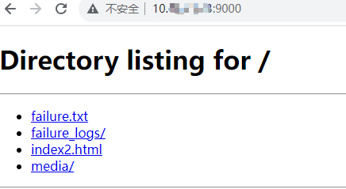
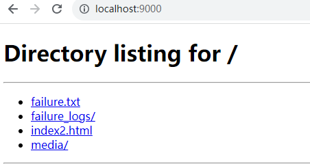
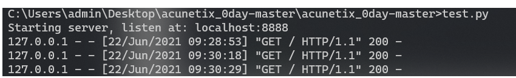
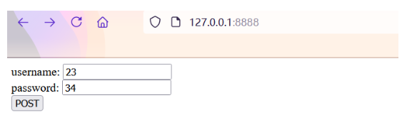
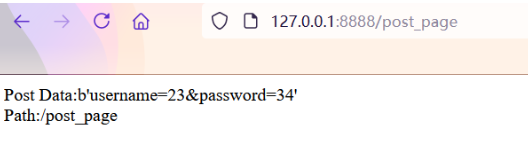

## http.server

Python自带的HTTP服务器模块-m http.server，包括如何使用它创建一个简单的Web服务器、如何配置该服务器以满足不同的需求、如何在服务器上托管静态文件等。

使用场景：快速发送大文件，共享文件夹目录

类似产品：Samba

### 运行命令

```python
python -m http.server
```

在这个命令中：

**`python`** 是调用Python解释器的命令

**`-m`** 是一个选项，用于指定要运行的模块

**`http.server`** 是要运行的模块名称。当这个命令被执行时，Python解释器会导入 `http.server` 模块，并启动一个HTTP服务器。默认情况下，这个服务器会在本地的8000端口上监听HTTP请求。

### 格式说明

```
C:\Users\wsw\log\4>python -m http.server -h
usage: server.py [-h] [--cgi] [--bind ADDRESS] [--directory DIRECTORY] [port]

positional arguments:
  port                  Specify alternate port [default: 8000]

optional arguments:
  -h, --help            show this help message and exit
  --cgi                 Run as CGI Server
  --bind ADDRESS, -b ADDRESS
                        Specify alternate bind address [default: all interfaces]
  --directory DIRECTORY, -d DIRECTORY
                        Specify alternative directory [default:current directory]

```


### 相关选项：

- **`-b `**或**`--bind `**: 指定服务器的IP地址。默认情况下，它会监听在localhost上。
- **`-p `**或`--port `: 指定服务器的端口号。默认情况下，它会在8000端口上启动， 如果不生效直接跟端口号。
- **`-d `**或**`--directory `**: 指定服务器的根目录。默认情况下，它会是当前目录。
- **`-w `**或**`--workers `**: 根据CPU核心数量自动分配工作线程数。
- **`-c `**或**`--persistent `**: 支持HTTP持久连接。
- **`-4 `**或**`--error-page-404 `**: 自定义404页面。
- **`-5 `**或**`--error-page-500 `**: 自定义500页面。

### 示例

#### 创建基本服务器

Python的mhttp.server模块可以让您在几分钟内创建一个Python-powered Web服务器。默认情况下，服务器将在本地主机上的8000端口上运行。如果您想快速测试某些东西，那么这里是一些基本的Python代码，可以立即启动一个Web服务器：

```
    python -m http.server
```

当您运行此命令时，Python将托管当前目录中的文件。可以在浏览器中输入http://localhost:8000 or  http://127.0.0.1:8000/访问该网站。

#### 自定义IP

您可以通过在运行命令时指定端口号来更改将要使用的端口。下面是使用9000端口的示例代码：

```
python -m http.server -b 1xx.xx.xxx.xxx
```

现在，在浏览器中访问http://1xx.xx.xxx.xxx:8000即可访问该网站。

#### 自定义端口号

您可以通过在运行命令时指定端口号来更改将要使用的端口。下面是使用9000端口的示例代码：

```
    python -m http.server 9000
```

现在，在浏览器中访问http://localhost:9000即可访问该网站。

#### 自定义IP与端口号

您可以通过在运行命令时指定端口号来更改将要使用的端口。下面是使用9000端口的示例代码：

```
    python -m http.server -b 1xx.xx.xxx.xxx 9000
```

现在，在浏览器中访问http://1xx.xx.xxx.xxx:9000/即可访问该网站。



#### 更改Web服务器目录

默认情况下，Python的mhttp.server将服务器的根目录设置为当前目录。如果您希望从其他目录提供文件，请使用-c选项指定服务器的文件夹。

```
    python -m http.server -c /path/to/directory
```

现在，在浏览器中访问http://localhost:8000即可访问该网站。

#### 启用目录列表

默认情况下，Python的mhttp.server会禁止目录列表。如果您想启用目录列表，请使用-d选项指定服务器的文件夹。

```
    python -m http.server -d /path/to/directory
```

现在，在浏览器中访问http://localhost:8000即可访问该网站，并显示目录列表。


### 问题：

1. 开启服务的文件夹下有index.html文件就不会展示文件夹目录；

 解释：

当你在文件夹下运行python -m http.server开启服务，并且该文件夹中存在一个名为index.html的文件时，浏览器将默认显示index.html文件，而不会显示文件夹目录。

index.html是默认的索引文件，当浏览器访问一个目录时，会自动寻找并加载该目录下的index.html文件作为默认页面。如果存在多个index.html文件，浏览器会按照一定的规则选择其中一个文件作为默认页面。

如果你希望展示文件夹目录，而不是默认加载index.html文件，你可以将index.html文件重命名或删除，这样浏览器将会显示文件夹目录。




代码调用

    from http.server import HTTPServer, BaseHTTPRequestHandler
     
    data = {'result': 'this is a test'}
    host = ('localhost', 8888)
     
    class Resquest(BaseHTTPRequestHandler):
        timeout = 5
        server_version = "Apache"   #设置服务器返回的的响应头 
        def do_GET(self):
            self.send_response(200)
            self.send_header("Content-type","text/html")  #设置服务器响应头
            self.send_header("test1","This is test!")     #设置服务器响应头
            self.end_headers()
            buf = '''<!DOCTYPE HTML>
                    <html>
                        <head>
                            <title>Get page</title>
                        </head>
                    <body>
                        <form action="post_page" method="post">
                            username: <input type="text" name="username" /><br />
                            password: <input type="text" name="password" /><br />
                            <input type="submit" value="POST" />
                        </form>
                    </body>
                    </html>'''
            self.wfile.write(buf.encode())  #里面需要传入二进制数据，用encode()函数转换为二进制数据   #设置响应body，即前端页面要展示的数据
     
        def do_POST(self):
            path = self.path
            print(path)
            #获取post提交的数据
            datas = self.rfile.read(int(self.headers['content-length']))    #固定格式，获取表单提交的数据
            #datas = urllib.unquote(datas).decode("utf-8", 'ignore')
     
            self.send_response(200)
            self.send_header("Content-type","text/html")    #设置post时服务器的响应头
            self.send_header("test","This is post!")
            self.end_headers()
     
            html = '''<!DOCTYPE HTML>
            <html>
                <head>
                    <title>Post page</title>  
                </head>
                <body>
                    Post Data:%s  <br />
                    Path:%s
                </body>
            </html>''' %(datas,self.path)
            self.wfile.write(html.encode())  #提交post数据时，服务器跳转并展示的页面内容
     
    if __name__ == '__main__':
        server = HTTPServer(host, Resquest)
        print("Starting server, listen at: %s:%s" % host)
        server.serve_forever()


然后我们可以启动http服务



访问一下，并提交数据看一下



获取到post数据





refers:

https://blog.csdn.net/HQC66666/article/details/132784054

https://www.python100.com/html/U0R3O1Q1EW50.html