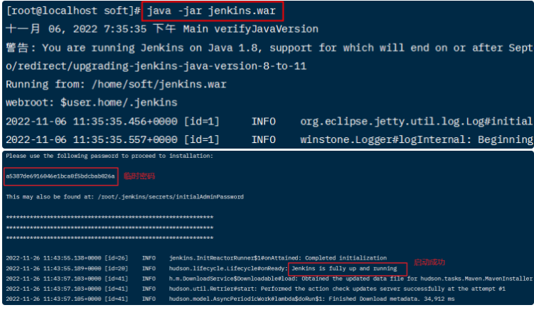
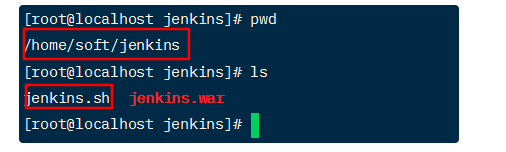
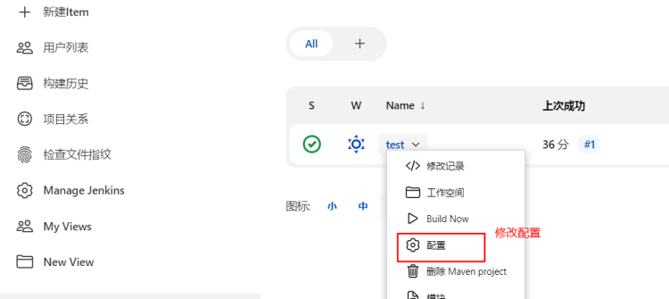
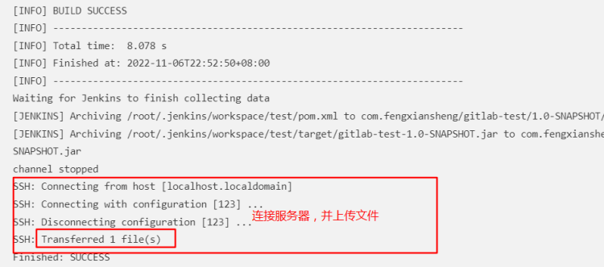
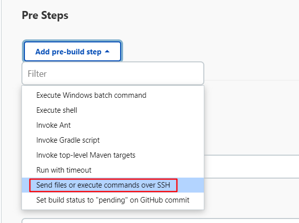
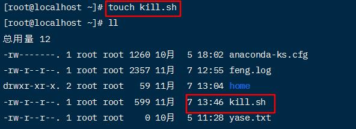
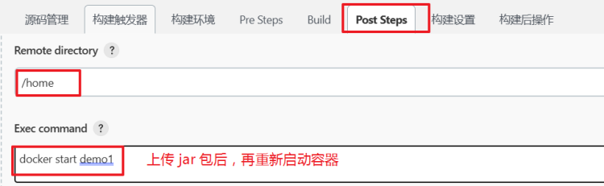
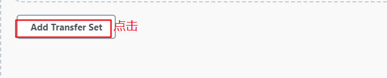
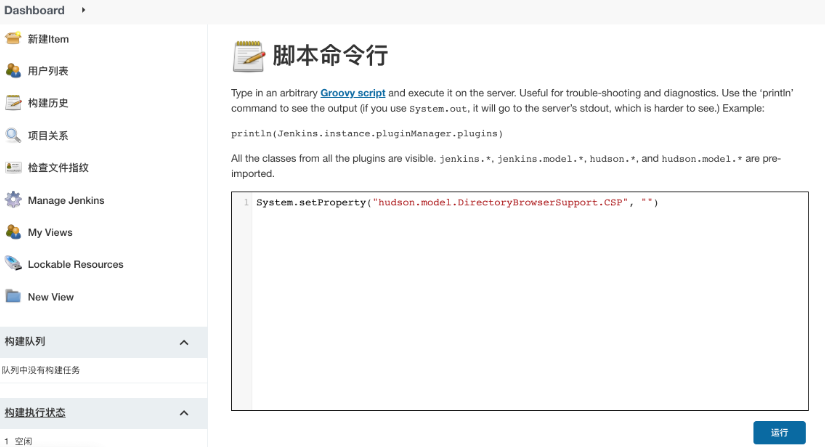

# Jenkins 基础

## 背景 

实际开发中，代码在提交后会进行部署，然后由测试人员测试，一般的部署流程：

●提交代码

●问一下同组小伙伴有没有要提交的代码

●在服务器上对代码打包（war包，或者jar包）

●关闭正在运行的程序，重新启动新的jar包

●观察日志看是否启动成功

●如果有同事说，自己还有代码没有提交......再次重复上面步骤！！！！！（一上午没了）

可以看出过程非常繁琐而且很浪费时间，而 Jenkins 就是帮助我们自动打包部署

## Jenkins

### 介绍 


Jenkins：是一个开源的、基于Java的一种持续集成工具，用于监控持续重复的工作，使软件的持续集成变成可能

jenkins项目有两条发布线，分别是LTS长期支持版（或稳定版）和每周更新版（最新版）。建议选择LTS长期支持版，下载通用war包

官网下载地址：

[https://www.jenkins.io/download/](https://www.jenkins.io/zh/download/)


如果不想下载最新版本，也可以下载历史版本：https://get.jenkins.io/war-stable/


另外，jenkins官网下载的比较慢，在推荐一个清华大学的镜像网站：https://mirrors.tuna.tsinghua.edu.cn/jenkins/war-stable/


注意：下载后，就是个war包


### 1.环境准备 

#### 1.安装要求 

- 机器要求： 
  - 256 MB 内存，建议大于 512 MB
  - 10 GB 的硬盘空间（用于 Jenkins 和 Docker 镜像）

- 需要安装以下软件： 
  - JDK 11、Maven、Git

#### 2.安装Maven 

下载地址：

https://archive.apache.org/dist/maven/maven-3/3.6.3/binaries/


上传到 CentOS 7 虚拟机上上


执行：

tar -zxvf apache-maven-3.6.3-bin.tar.gz


然后，修改 setting.xml，配置阿里云仓库

```
<mirror>
  <id>nexus-aliyun</id>
  <name>nexus-aliyun</name>
  <url>http://maven.aliyun.com/nexus/content/groups/public</url>
  <mirrorOf>central</mirrorOf>
</mirror>
```

结果：


本地仓库：/home/soft/repo


#### 3.安装Git 

执行：

yum install git


 

### 安装、配置jenkins 

就是一个war包，可以直接运行


执行：

java -jar jenkins.war





注意：启动jenkins时候，可能会报以下错误


针对于这个问题，只需要在linux中安装一个软件就可以了，比如：


之后在启动就没有问题了

然后浏览器访问：

http://192.168.228.122:8080/


设置用户密码


配置url，直接点击完成


接下来，安装maven插件


结果：


### 3.快速体验 

#### 3.1 创建构建任务 


1任务名称、任务类型


#### 3.2描述信息


#### 3.3源码管理：配置 git地址、代码分支


#### 3.4选择构建触发器


#### 3.5构建环境


#### 3.6构建前执行


#### 3.7Build：配置Maven


在页面的最下方可以：新增Maven


点击新增后：


指定pom.xml位置


#### 3.8构建后运行


 2. 运行构建任务 


回到首页，可以运行构建任务


查看状态：

任务进度：


可以看到构建日志：


结果：


在 jenkins 工作目录中可以看到打包好的jar包


运行jar包


### 4.jenkins开机启动 

每次启动jenkins都要：


非常不方便，可以编写脚本，在开机时就启动 jenkins


1创建 jenkins.sh

```
#!/bin/bash
JAVA_HOME=/home/soft/jdk1.8.0_202/bin
 
pid=`ps -ef | grep jenkins.war | grep -v 'grep'| awk '{print $2}'| wc -l`

if [ "$1" = "start" ];then
  if [ $pid -gt 0 ];then
  	echo 'jenkins is running...'
	else
  	### java启动服务 配置java安装根路径,和启动war包存的根路径
  	nohup $JAVA_HOME/java -jar /home/soft/jenkins/jenkins.war > /home/soft/jenkins/jen.log 2>&1 &
  fi
elif [ "$1" = "stop" ];then
  exec ps -ef | grep jenkins | grep -v grep | awk '{print $2}'| xargs kill -9
  echo 'jenkins is stop..'
elif [ "$1" = "restart" ];then
  echo 'jenkins is restart..'
  if [ $pid -gt 0 ];then
  	exec ps -ef | grep jenkins | grep -v grep | awk '{print $2}'| xargs kill -9
  fi
  nohup $JAVA_HOME/bin/java -jar /home/soft/jenkins/jenkins.war > /home/soft/jenkins/jen.log 2>&1 &
else
  echo "Please input like this:"./jenkins.sh start" or "./jenkins stop""
fi
```



2设置可执行权限：chmod u+x jenkins.sh


3到 /lib/systemd/system 目录下创建 jenkins.service


```
[Unit]
Description=Jenkins
After=network.target
 
[Service]
Type=forking
ExecStart=/home/soft/jenkins/jenkins.sh start
ExecReload=
ExecStop=/home/soft/jenkins/jenkins.sh stop
PrivateTmp=true
 
[Install]
WantedBy=multi-user.target
```

刷新服务配置：systemctl daemon-reload 设置开机启动：systemctl enable jenkins.service


也可以通过：systemctl start/stop jenkins.service ，启动或关闭服务


执行：systemctl status jenkins.service，查看状态


### 5.自动发布 

jenkins可以在打包后，自动把jar包发送到服务器中，然后启动

 1. 安装ssh插件 


 2. 配置远程服务器 

1选择 系统配置


2最下方找到SSH Servers


3添加ssh配置


4输入密码：


5测试连接


 3. 设置 Post Steps 




1构建后通过ssh发送文件


2选择服务器，并配置jar文件路径


注意：上图中说的test在 /root/.jenkins/workspace路径下


3设置远程上传目录


4再次构建




5目标服务器查看


发现上传的jar包是在 /root/home/target 目录下（自动创建了target目录）


6修改配置


再次构建后查看：


 4. 运行jar包 

配置上传后，执行命令：


注意：

远程服务器需要提前安装JDK

```
source /etc/profile
nohup java -jar /root/home/*.jar > /root/javasm.log 2>&1 &
```

结果：


浏览器也可正常访问


 5. Pre Steps 

构建之前，杀掉前一次构建启动的java程序




设置执行脚本的命令：./kill.sh daji-git-1.0-SNAPSHOT.jar


注意：

默认会去 /root 目录下，找 kill.sh 文件


在服务器上创建kill.sh




```
#!/bin/bash

#删除历史数据
rm -rf home/

#获取执行脚本时传入的参数，比如上图中的gitlab-test-1.0-SNAPSHOT.jar
appname=$1

#获取正在运行的jar包pid
pid=`ps -ef | grep $1 | grep 'java -jar' | awk '{printf $2}'`

#如果pid为空，提示一下，否则，执行kill命令
if [ -z $pid ];
#使用-z 做空值判断
	then
		echo "$appname not started"
	else
		kill -9 $pid
		echo "$appname stoping...."
#检查pid是否被kill掉
check=`ps -ef | grep -w $pid | grep java`
if [ -z $check ];
	then
		echo "$appname pid:$pid is stop"
	else
		echo "$appname stop failed"
fi
fi
```


设置可执行权限：chmod u+x kill.sh


再次构建：


## 容器化构建 

外挂目录 

 1. docker启动外部的 jar 包 

使用数据卷映射的方式，docker可以启动外部的 jar 包

```
docker run -d -p 8080:8080 \
-v /root/home/daji-git-1.0-SNAPSHOT.jar:/root/app.jar \
--name=demo1 \
java:8 java -jar /root/app.jar
# 注意：需要先拉取 java:8 的镜像，如果不存在换一个版本
```


浏览器访问，结果：


 2. Jenkins配置 

1Pre Steps

构建前，删除上一次的jar包，并暂停容器


2Post Steps



 3. 结果 


 2. build docker 镜像 

注意：删除之前的容器和镜像

1在项目中创建dockerfile


```
FROM java:8
EXPOSE 8080
WORKDIR /root/home
ADD daji-git-1.0-SNAPSHOT.jar /root/app.jar
ENTRYPOINT ["java","-jar","/root/app.jar"]
```

2Pre Steps
构建前，删除上一次的容器、镜像


```
docker rm -f daji
docker rmi daji:1.0
```

3.Post Steps


 4创建一个新的Transfer Set




传送dockerfile文件


 

```
cd home
docker build -f dockerfile -t daji:1.0 .
docker run -d -p 8080:8080 --name=daji daji:1.0
```

5构建后结果：


## 问题 

#### 超时 


默认超时时间是120秒

如果遇到上面错误，可能：

- 启动时间太长 
  - 如果项目比较大，启动时间会很长，这时可以修改超时时间


●启动命令不合理 

比如：nohup java -jar /root/home/*.jar &，这个命令会卡住


- 修改命令：nohup java -jar /root/home/*.jar > /root/feng.log 2>&1 &

- 启动日志会输入到 /root/feng.log文件中，但这样项目运行时间太长会导致文件很大 

■解决：配置自己的log生成方式，并修改命令：

nohup java -jar /root/home/*.jar > /dev/null 2>&1 & /dev/null：这是一个黑洞文件，往这里写东西，相当于丢弃

#### 文件上传失败 


出现上图问题，表示文件路径配置错误，参考下图：


#### Cannot run program "java" 

Cannot run program "java" (in directory "/root/.jenkins/workspace/test")


jenkins的日志中：hudson.maven.MavenModuleSet cannot be cast to hudson.model.Project

错误报告的很奇怪，使用 java -jar jenkins.war 运行，构建不报错

但是配置 jenkins.service 后，让 jenkins 开机自启动，构建就一直不成功

目前怀疑 jenkins.service 文件有问题，先记录问题，以后再解决

解决：


配置JDK就行了


## 报告展示

安装html插件

- 安装HTML Publisher plugin插件


因为jenkins默认没有加载css样式，生成的测试报告无样式如下


- 处理html报告的样式问题

　　原因分析

　　Jenkins为了避免受到恶意HTML/JS文件的攻击，会默认将安全策略CSP设置为：

　　sandbox; default-src 'none'; img-src 'self'; style-src 'self';

　　在此配置下，只允许加载：

　　1、Jenkins服务器上托管的CSS文件

　　2、Jenkins服务器上托管的图片文件

　　以下形式的内容都会被禁止：

- Java
- plugins (object/embed)
- HTML中的内联样式表（Inline style sheets），以及引用的外站CSS文件
- HTML中的内联图片（Inline image definitions），以及外站引用的图片文件
- frames
- web fonts
- XHR/AJAX

　　解决办法

　　方法一：修改CSP(Content Security Policy)的默认配置，到Jenkins系统管理à脚本命令行，执行以下Groovy命令，然后点击运行。配置完成后，重新构建原有项目，HTML页面即可正常显示。

 ```
System.setProperty("hudson.model.DirectoryBrowserSupport.CSP", "") 
 ```



然而当你重新启动jenkins时，你会发现，HTML页面再次面目全非，CSP恢复为默认配置，因此这个办法只是临时方案。

　　方法二：利用jenkins的Groovy 插件永久解决这个问题

　　1、Groovy plugin: 可实现直接执行Groovy代码。

　　解决步骤如下：

　　在“构建”模块，选择“Execute system Groovy script”，执行如下Groovy命令：

 ```
System.setProperty("hudson.model.DirectoryBrowserSupport.CSP", "") 
 ```


 

最终的报告样子如下图：

